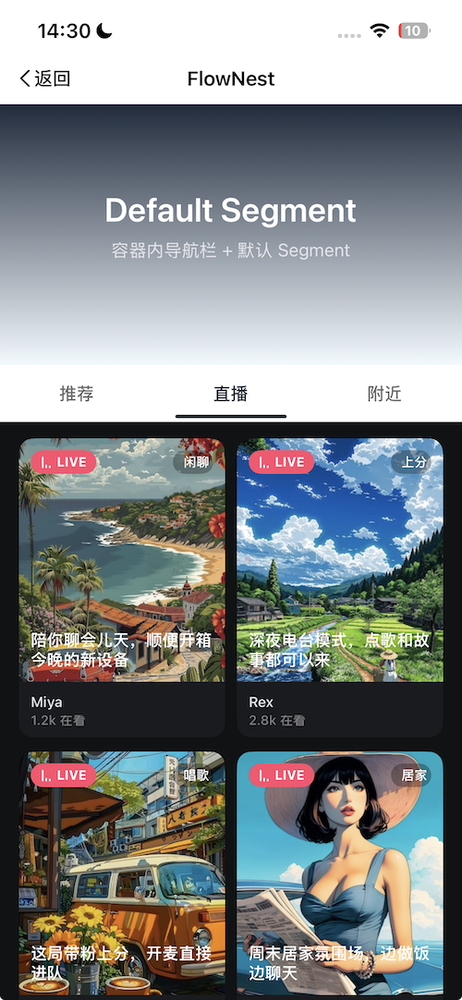
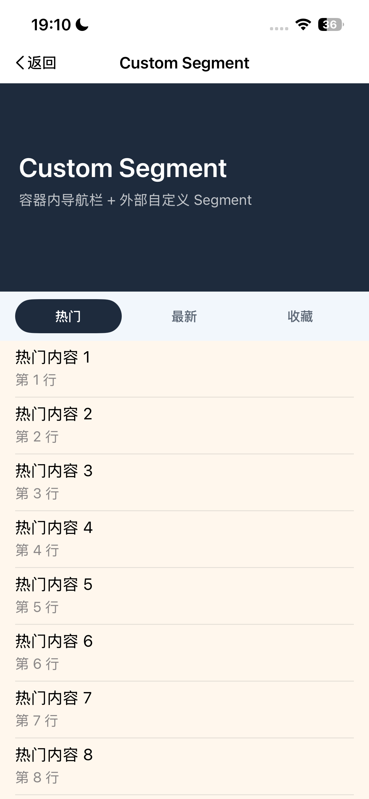
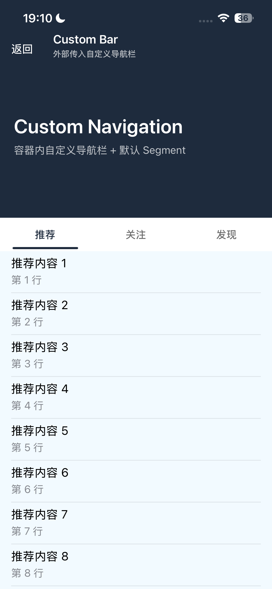

# FlowNest

## 引言

在 UIKit 项目里，有一类页面几乎反复出现：顶部是一块可自由定制的表头，中间是一条可点击切换的导航或 Segment，下面承载多个子列表；表头在上滑时逐步收起，切换不同分页后，内部列表还能继续保持自然的滚动衔接。

这类页面看起来不复杂，但真正落地时，往往会遇到几个很实际的问题：

- 表头和子列表的滚动关系不容易处理，尤其是父子 `scrollView` 的切换时机；
- 切换分页后，要不要保留上一页的滚动状态，体验上很容易不一致；
- 导航栏、Header、Segment 三者在不同业务里经常要改样式，硬编码的复用价值很低；
- 一旦项目里类似页面越来越多，复制粘贴式实现很快就会让维护成本失控。

`FlowNest` 就是围绕这个场景拆出来的一个 UIKit 容器组件。它的目标并不是提供一套固定 UI，而是提供一个稳定的“容器层”，让你把注意力放回到页面结构和业务内容本身。你可以把它理解成一个专门服务于“共享 Header + 多分页子列表联动”的基础设施。

本文不展开具体源码细节，重点只讲三件事：

1. 这个仓库适合解决什么问题；
2. `FlowNest` 的整体工作方式是什么；
3. 实际项目里应该怎么接入，以及三种典型示例分别怎么用。

仓库地址：`https://github.com/Louis1239/FlowNest`

## 效果预览


## 仓库介绍

`FlowNest` 是一个基于 UIKit 的容器组件，用来快速搭建“共享表头 + 顶部切换栏 + 多子列表联动滚动”的页面。它的核心思路比较直接：由容器统一管理外层滚动、分页切换和顶部区域布局，业务侧只需要提供 Header、可选的导航栏、可选的 Segment，以及真正承载内容的子控制器。

从能力上看，这个仓库主要覆盖了几个常见需求：

- 支持共享表头；
- 支持左右分页切换；
- 支持父子滚动联动；
- 支持内置导航栏，也支持外部传入自定义导航栏；
- 支持内置 Segment，也支持外部传入自定义 Segment；
- 支持自定义 HeaderView；
- 支持下拉刷新，并把刷新事件透传给当前子列表；
- 子控制器接入简单，只需要暴露真正参与联动的滚动视图。

这意味着它非常适合下面这些页面类型：

- 个人主页；
- 频道页；
- 电商首页；
- 内容社区聚合页；
- 直播、推荐、附近这类“同一容器下多内容分发”的场景。

如果你的页面结构只是一个普通列表，或者顶部区域不会跟列表发生联动，那其实没必要为了“组件化”而上这套容器；但只要你已经遇到“共享 Header + 多子页面 + 联动滚动”这种组合，`FlowNest` 就会比手写一套临时逻辑更稳。

## 实现原理

虽然本文不深入源码，但还是有必要先理解一下它的整体工作方式。

`FlowNest` 本质上是一个容器控制器 `FlowNestContainerViewController`。在这个容器里，顶部区域由三部分组成：

- 容器内导航栏；
- 共享 Header；
- Segment 切换栏。

这三部分都由容器统一布局，而真正的业务内容则以多个子控制器的形式被放入横向分页区域中。外层负责垂直方向的总滚动，内层负责分页切换，当前展示的子控制器再把它自己的 `UITableView` 或 `UICollectionView` 暴露给容器，由容器去做滚动协调。

所以从使用者的角度看，`FlowNest` 只做三件事：

1. 统一管理顶部区域；
2. 统一管理分页切换；
3. 统一管理父子滚动关系。

而业务方真正需要关心的，反而很少：

- Header 长什么样，你自己决定；
- Segment 要不要自定义，你自己决定；
- 导航栏要不要外部自定义，你自己决定；
- 每个分页里渲染什么内容，仍然由普通的 `UIViewController` 去完成。

这种分层的好处非常明显：组件把“容器问题”收走，业务保留“内容自由度”。换句话说，`FlowNest` 不是帮你生成页面，而是帮你把页面骨架搭稳定。

## 使用方法

### 1. 安装

如果你使用 CocoaPods，可以直接在 `Podfile` 里添加：

```ruby
pod 'FlowNest'
```

如果还没有发正式版本，也可以直接引用 Git 仓库：

```ruby
pod 'FlowNest', :git => 'https://github.com/Louis1239/FlowNest.git', :tag => '0.1.0'
```

环境要求目前比较简单：

- iOS 15.0+
- UIKit
- MJRefresh

### 2. 创建容器

第一步是创建一个 `FlowNestConfig`，把顶部布局结构描述清楚：

```swift
import UIKit
import FlowNest

let config = FlowNestConfig()
config.navigationBarHeight = 88
config.navigationBarTitle = "FlowNest"
config.headerHeight = 220
config.segmentHeight = 48

let container = FlowNestContainerViewController(config: config)
```

这里最常用的几个参数分别是：

- `navigationBarHeight`：容器内导航栏高度，传 `0` 表示不显示；
- `navigationBarTitle`：默认导航栏标题；
- `showsNavigationBarBackButton`：是否显示默认返回按钮；
- `headerHeight`：共享 Header 的高度；
- `segmentHeight`：顶部切换栏高度；
- `maxOffset`：父子滚动切换阈值，默认会使用 `headerHeight`。

如果你的页面没有容器内导航栏，直接把 `navigationBarHeight` 设为 `0` 即可。

### 3. 设置 Header、Segment 和子控制器

创建好容器以后，可以按需给它传入自定义 Header：

```swift
container.headerView = headerView
```

如果你不想使用默认 Segment，也可以直接传入自己的：

```swift
container.segmentView = customSegmentView
```

最后，把子控制器交给容器管理：

```swift
container.setViewControllers([
    firstViewController,
    secondViewController,
    thirdViewController
])
```

到这里，一个完整容器就已经成立了。

### 4. 子控制器如何接入

每个子控制器都需要遵循 `FlowNestChildProtocol`，把内部真实参与联动的滚动视图暴露出来。

例如，列表页如果内部是一个 `tableView`，写法就是：

```swift
final class DemoRecommendViewController: UIViewController, FlowNestChildProtocol {
    private let tableView = UITableView()

    var nestedScrollView: UIScrollView {
        tableView
    }
}
```

如果你的子页面还希望响应容器下拉刷新，那么再额外遵循 `FlowNestRefreshableChildProtocol`：

```swift
extension DemoRecommendViewController: FlowNestRefreshableChildProtocol {
    func flowNestHandleRefresh(completion: @escaping () -> Void) {
        // 请求数据
        completion()
    }
}
```

这里有一个很重要的边界：`FlowNest` 只关心“谁负责滚动”，不关心“你怎么请求数据、怎么渲染 UI、怎么处理业务状态”。这也是它能保持通用性的原因。

### 5. 三种示例怎么用

为了让接入方式更直观，仓库的 Example 里给出了三种很典型的示例。它们本质上对应了三种不同的页面搭建方式。

#### 示例一：有导航栏 + 默认 Segment



这是最适合第一次接入的方式。你只需要配置容器内导航栏，提供一个 Header，再交给容器一组子控制器即可。导航栏和 Segment 都直接使用组件默认实现，业务侧最省心。

这种模式适合：

- 快速验证容器结构；
- 页面风格比较标准，不需要深度定制；
- 希望先把联动能力接起来，再逐步细化视觉。

如果你的页面是“频道首页”“内容分发页”“简单个人主页”，通常都可以先从这个模式起步。

#### 示例二：有导航栏 + 自定义 Segment



当默认 Segment 不够用时，可以保留容器内导航栏不动，只替换 Segment。比如你希望选中态更明显、交互更品牌化，或者要做胶囊式、卡片式、特殊动效的切换栏，这种方式就更合适。

这里的核心不是“完全重写页面”，而是只替换最有品牌表达需求的那一层。
容器仍然负责分页同步和滚动联动，你的自定义 Segment 只需要遵循 `FlowNestSegmentContentProtocol`，把标题、选中项和点击回调接上即可。

这种模式特别适合：

- 内容社区；
- 电商活动频道；
- 需要品牌化视觉的内容入口页。

#### 示例三：自定义导航栏 + 默认 Segment



如果你的页面需要一个强业务感的导航栏，比如顶部不只是标题，还要放副标题、返回按钮、状态信息，甚至后续还要扩展搜索、筛选、运营入口，那么就可以把导航栏也交给业务侧自己实现。

这时容器依然负责整体结构，只是导航栏这一层不再使用默认实现：

```swift
container.navigationBarView = customNavigationBarView
```

这种方式的价值在于：你既保留了 `FlowNest` 对滚动和分页的托管能力，又不会被默认导航样式束缚。
很多项目真正落地时，往往不是 Header 最特殊，而是导航栏最先需要被业务改造，所以这类能力是非常实用的。

### 6. 当前示例里的子页面组合

除了三种容器层示例，当前 Example 里的子分页内容也已经补成了完整演示：

- `推荐`：卡片式信息流列表；
- `直播`：两列直播间卡片流；
- `附近`：带氛围 Header 的附近交友列表。

这部分很适合拿来验证一个关键点：`FlowNest` 并不限制子页面内容形态。
你可以在同一个容器里同时放入 `UITableView`、`UICollectionView`，甚至不同交互风格的页面，只要它们都明确提供联动用的滚动视图，就能在同一套容器结构下工作。

### 7. 运行示例工程

如果你想直接跑 Example，看三种场景和三类子分页的组合效果，可以使用：

```bash
cd Example
pod install
open FlowNest.xcworkspace
```

打开后运行 Example，即可看到完整的三套容器示例以及推荐、直播、附近三个子页面。

## 结语

很多 UIKit 组件在设计时，容易走向两个极端：
要么封装得过重，业务方几乎失去定制空间；要么封装得过浅，最后只是把一堆示例代码换了个目录重新放一遍。

`FlowNest` 比较可贵的一点，是它把边界切得相对清楚：

- 容器负责结构；
- 业务负责内容；
- 默认实现负责开箱即用；
- 自定义能力负责真正落地。

所以它最适合的用法，不是拿来“做一个 Demo”，而是拿来作为项目里这类页面的统一基础设施。
一旦你的项目里开始出现第二个、第三个共享 Header 的分页页面，这种统一容器的价值就会非常明显：交互更稳定，接入更一致，后续维护也更可控。

如果你最近正好在做个人主页、内容频道、直播聚合、社区分发、电商首页这类页面，不妨直接把 Example 跑起来，然后从“默认导航栏 + 默认 Segment”开始接。等结构跑通以后，再逐步替换成自己的 Header、Segment 和导航栏样式，这会比从零手写一整套联动逻辑高效很多。

如果你觉得这个仓库对你有帮助，欢迎到 GitHub 看看，也欢迎继续把它扩展成更贴近你业务场景的页面容器。
