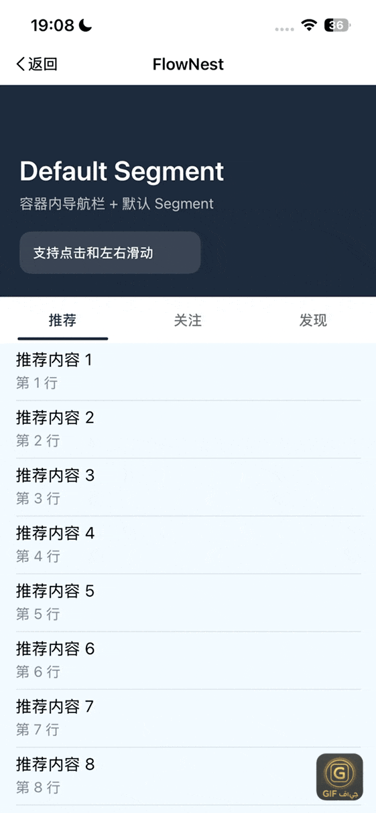

# FlowNest

FlowNest 是一个基于 UIKit 的容器组件，用来快速搭建“共享表头 + 顶部切换栏 + 多子列表联动滚动”的页面。

- 支持共享表头
- 支持左右分页切换
- 支持父子滚动联动
- 支持内置导航栏，也支持自定义导航栏
- 支持内置 Segment，也支持自定义 Segment
- 支持自定义 HeaderView
- 支持下拉刷新，并把刷新事件透传给当前子列表
- 接入简单，只需要传入子控制器，并让子控制器遵循协议即可

## 效果预览



## 功能特点

- `HeaderView` 可自定义，适合个人主页、电商频道、内容聚合页等场景
- `SegmentView` 可使用内置实现，也可以外部传入完全自定义的视图
- `NavigationBarView` 可使用内置实现，也可以外部传入自定义导航栏
- 父 `ScrollView` 和子列表滚动联动，滚动切换更自然
- 支持点击切换和左右滑动切换分页
- 支持父层下拉刷新，刷新动作转发给当前子列表处理

## 安装

### CocoaPods

```ruby
pod 'FlowNest'
```

如果你在 CocoaPods 正式发布前使用 Git 仓库，也可以这样接入：

```ruby
pod 'FlowNest', :git => 'https://github.com/Louis1239/FlowNest.git', :tag => '0.1.0'
```

## 环境要求

- iOS 15.0+
- UIKit
- MJRefresh

## 快速开始

```swift
import UIKit
import FlowNest

let config = FlowNestConfig()
config.navigationBarHeight = 88
config.navigationBarTitle = "FlowNest"
config.headerHeight = 220
config.segmentHeight = 48

let container = FlowNestContainerViewController(config: config)
container.headerView = headerView
container.setViewControllers([
    firstViewController,
    secondViewController,
    thirdViewController
])

navigationController?.pushViewController(container, animated: true)
```

## 接入方式

FlowNest 的使用方式比较轻量，核心只需要两步：

1. 创建 `FlowNestContainerViewController`
2. 传入子控制器数组

每个子控制器只需要遵循 `FlowNestChildProtocol`，把内部实际用于联动的滚动视图暴露出来即可。

```swift
final class DemoListViewController: UIViewController, FlowNestChildProtocol {
    let nestedScrollView: UIScrollView
}
```

如果你需要让父层下拉刷新触发当前子列表加载数据，再额外遵循 `FlowNestRefreshableChildProtocol`：

```swift
extension DemoListViewController: FlowNestRefreshableChildProtocol {
    func flowNestHandleRefresh(completion: @escaping () -> Void) {
        // 加载数据
        completion()
    }
}
```

## 配置说明

`FlowNestConfig` 当前主要提供这些配置：

- `navigationBarHeight`：内置导航栏高度，传 `0` 表示不显示
- `navigationBarTitle`：内置导航栏标题
- `showsNavigationBarBackButton`：是否显示内置返回按钮
- `navigationBarBackButtonTitle`：内置返回按钮文案
- `headerHeight`：共享表头高度
- `segmentHeight`：切换栏高度
- `maxOffset`：父子滚动切换阈值，传 `0` 时默认等于 `headerHeight`

## 自定义能力

### 自定义 Header

直接给 `headerView` 赋值即可：

```swift
container.headerView = customHeaderView
```

### 自定义 Segment

如果你不传，FlowNest 会使用内置的 `FlowNestSegmentView`。

如果你想自定义 Segment，可以直接传入自己的 `segmentView`。
如果你的自定义 Segment 需要和分页状态联动，请遵循 `FlowNestSegmentContentProtocol`：

```swift
final class CustomSegmentView: UIView, FlowNestSegmentContentProtocol {
    var titles: [String] = []
    var selectedIndex: Int = 0
    var onSelect: ((Int) -> Void)?
}
```

### 自定义导航栏

如果你不传，FlowNest 会使用内置的 `FlowNestNavigationView`。

如果你想完全控制导航栏样式，可以直接传入：

```swift
container.navigationBarView = customNavigationBarView
```

## 示例工程

当前 Example 内置了 4 个示例：

- 无导航栏 + 默认 Segment
- 内置导航栏 + 默认 Segment
- 内置导航栏 + 自定义 Segment
- 自定义导航栏 + 默认 Segment

你可以在 README 中继续补充对应截图：

### 1. 无导航栏 + 默认 Segment


### 2. 内置导航栏 + 默认 Segment


### 3. 内置导航栏 + 自定义 Segment


### 4. 自定义导航栏 + 默认 Segment


运行 Example：

```bash
cd Example
pod install
open FlowNest.xcworkspace
```

## 适用场景

- 个人主页
- 频道页
- 电商首页
- 社区内容页
- 任何“顶部信息区域 + 多 tab 子列表”的页面

## Author

Louis, 13032678708@163.com
可以通过邮箱联系到我

## License

FlowNest is available under the MIT license. See the LICENSE file for more info.
